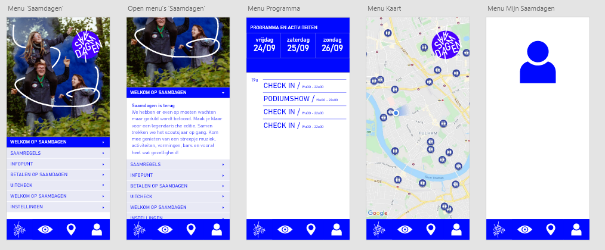

# Saamdagen

Android app voor de komende editie van Saamdagen.

De applicatie voor de editie van 2020 is een Angular PWA zodat deze beschikbaar is voor apparaten van alle geuren en kleuren.

## Setup/Running

### Installatie

- Node.js
- Angular CLI (`$ npm install -g @angular/cli`)

### Lokaal uitvoeren (development)

- `$ npm install`
- `$ npm start`

### PWA functionaliteit testen

Door `ng serve` uit te voeren wordt de PWA functionaliteit niet 'geactiveerd'. Daarvoor moet er een productie build gemaakt worden. Die moet vervolgens geserved worden door een http server.

- `$ npm install -g http-server` (eenmalig)
- `$ ng build --configuration production`
- `$ http-server -c-1 dist/saamdagen`

### Branching

**master:** Code zoals ze in productie is. Changes op deze branch triggeren een build en deploy

**saamdagen-2019:** App voor de editie van 2019. Deze versie wordt bewaard in een aparte branch omdat er tussen '19 en '20 volledig opnieuw werd begonnen.

### CI/CD

Elke push/merge naar de **master** branch triggert een build en deploy naar app.saamdagen.be. Aanvullend bij de build, wordt ook **ng lint** uitgevoerd. De applicatie wordt gehost op Azure in een 'Static Web App'.

Pull Requests naar master triggeren ook een build. Deze wordt ook gedeployed naar een tijdelijke omgeving waar je je changes kan (laten) valideren vooraleer er gemerged wordt naar master.

### Google Maps

`@angular/google-maps` wordt gebruikt voor het weergeven van een kaart/grondplan. In `index.html` wordt de API sleutel opgegeven. Deze sleutel kan niet geheim zijn aangezien het hier gaat over een frontend applicatie. Daarom is het belangrijk dat er restricties worden ingesteld in de API Console van Google.

De sleutel kan ook niet ingeladen worden via de environment.ts file omdat het script in index.html wordt ingeladen. Op het moment van inladen, is onze Angular applicatie nog niet gestart.

### Base design

De app zou er ongeveer zo moeten uitzien

